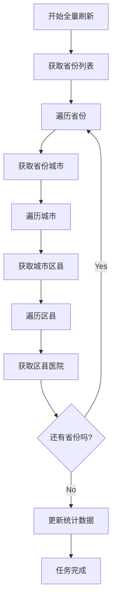
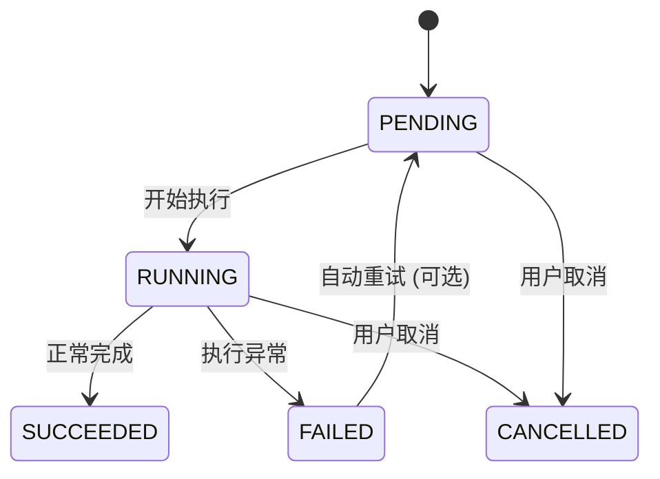

# 任务管理系统说明

## 概述

任务管理系统是医院层级扫查微服务的核心组件，负责管理异步数据刷新任务，支持任务创建、监控、执行和清理。系统采用异步编程模式，能够高效处理大量数据刷新任务，同时提供实时进度跟踪和错误处理机制。

## 系统特性

### 🎯 核心功能
- **异步任务调度**: 支持全量刷新和指定省份刷新的异步任务
- **任务状态管理**: 完整的状态跟踪（PENDING, RUNNING, SUCCEEDED, FAILED）
- **进度跟踪**: 实时进度更新和详细步骤描述
- **并发控制**: 使用信号量限制并发数，避免资源过载
- **错误恢复**: 自动重试机制和指数退避策略

### 🔧 技术特性
- **高性能**: 异步非阻塞执行，提高系统吞吐量
- **可扩展**: 支持任务扩展和自定义处理逻辑
- **容错性**: 完善的错误处理和恢复机制
- **监控性**: 详细的任务执行日志和统计信息
- **可控性**: 支持任务取消、暂停和优先级管理

## 快速开始

### 基本使用

```python
import asyncio
from tasks import TaskManager

async def basic_task_example():
    # 创建任务管理器
    manager = TaskManager()
    
    # 创建全量刷新任务
    task_id = await manager.create_full_refresh_task()
    print(f"任务已创建: {task_id}")
    
    # 查询任务状态
    while True:
        task = await manager.get_task_status(task_id)
        print(f"任务状态: {task['status']}, 进度: {task['progress']}%")
        
        if task['status'] in ['SUCCEEDED', 'FAILED']:
            break
        
        await asyncio.sleep(2)  # 等待2秒后再次检查

asyncio.run(basic_task_example())
```

### 指定省份刷新

```python
async def province_refresh_example():
    manager = TaskManager()
    
    # 创建广东省刷新任务
    task_id = await manager.create_province_refresh_task("广东省")
    
    # 监控任务执行
    while True:
        task = await manager.get_task_status(task_id)
        if task['current_step']:
            print(f"当前步骤: {task['current_step']}")
        
        if task['status'] in ['SUCCEEDED', 'FAILED']:
            break
        
        await asyncio.sleep(1)

asyncio.run(province_refresh_example())
```

## 任务类型详解

### 1. 全量刷新任务 (Full Refresh Task)

全量刷新所有省份及其下属城市、区县、医院数据。

#### 任务特征
- **范围**: 覆盖全国34个省级行政区
- **数据量**: 约100万条医院记录
- **执行时间**: 30-60分钟（取决于LLM API响应速度）
- **并发控制**: 最大5个并发任务

#### 执行流程


#### 使用示例
```python
async def create_full_refresh():
    manager = TaskManager()
    
    # 创建全量刷新任务
    task_id = await manager.create_full_refresh_task()
    
    print(f"全量刷新任务已创建: {task_id}")
    
    # 监听任务进度
    async def monitor_progress():
        while True:
            task = await manager.get_task_status(task_id)
            
            print(f"进度: {task['progress']}%")
            if task['current_step']:
                print(f"当前步骤: {task['current_step']}")
            
            if task['status'] in ['SUCCEEDED', 'FAILED']:
                if task['status'] == 'SUCCEEDED':
                    print("全量刷新任务成功完成!")
                else:
                    print(f"任务失败: {task['error_message']}")
                break
            
            await asyncio.sleep(5)
    
    # 启动监控
    await monitor_progress()

# 运行全量刷新
asyncio.run(create_full_refresh())
```

### 2. 省份刷新任务 (Province Refresh Task)

刷新指定省份及其下属城市、区县、医院数据。

#### 任务特征
- **范围**: 指定的单个省份
- **数据量**: 1万-10万条记录（取决于省份大小）
- **执行时间**: 1-10分钟
- **适用场景**: 定期更新特定地区数据

#### 使用示例
```python
async def refresh_single_province():
    manager = TaskManager()
    
    # 创建广东省刷新任务
    task_id = await manager.create_province_refresh_task("广东省")
    
    # 获取任务预估时间
    task = await manager.get_task_status(task_id)
    print(f"任务创建时间: {task['created_at']}")
    
    # 等待任务完成
    await manager.wait_for_completion(task_id, timeout=3600)
    
    # 获取任务结果
    final_task = await manager.get_task_status(task_id)
    if final_task['status'] == 'SUCCEEDED':
        print("省份刷新完成!")
    else:
        print(f"刷新失败: {final_task['error_message']}")

# 运行省份刷新
asyncio.run(refresh_single_province())
```

## 任务管理API

### TaskManager类

#### 初始化参数

```python
class TaskManager:
    def __init__(
        self, 
        db: Database = None,
        llm_client: LLMClient = None,
        max_concurrent_tasks: int = 5,
        task_timeout: int = 7200  # 2小时
    ):
        """
        初始化任务管理器
        
        Args:
            db: 数据库实例
            llm_client: LLM客户端实例  
            max_concurrent_tasks: 最大并发任务数
            task_timeout: 任务超时时间（秒）
        """
```

#### 主要方法

##### create_full_refresh_task()

创建全量刷新任务。

```python
async def create_full_refresh_task(self) -> str:
    """
    创建全量刷新任务
    
    Returns:
        str: 任务ID
    
    Raises:
        TaskCreationError: 任务创建失败
    """
```

**使用示例:**
```python
manager = TaskManager()
task_id = await manager.create_full_refresh_task()
print(f"任务ID: {task_id}")
```

##### create_province_refresh_task()

创建指定省份刷新任务。

```python
async def create_province_refresh_task(self, province_name: str) -> str:
    """
    创建省份刷新任务
    
    Args:
        province_name: 省份名称
    
    Returns:
        str: 任务ID
    
    Raises:
        ValidationError: 省份名称无效
        TaskCreationError: 任务创建失败
    """
```

**使用示例:**
```python
manager = TaskManager()
task_id = await manager.create_province_refresh_task("广东省")
print(f"广东省刷新任务ID: {task_id}")
```

##### get_task_status()

获取任务状态信息。

```python
async def get_task_status(self, task_id: str) -> Dict[str, Any]:
    """
    获取任务状态
    
    Args:
        task_id: 任务ID
    
    Returns:
        Dict[str, Any]: 任务状态信息
    
    Raises:
        TaskNotFoundError: 任务不存在
    """
```

**响应格式:**
```python
{
    'task_id': 'task_20231121_143052_123456',
    'hospital_name': '全量刷新',
    'query': None,
    'status': 'RUNNING',
    'progress': 65,
    'current_step': '正在获取区县数据：越秀区',
    'created_at': '2023-11-21T14:30:52',
    'updated_at': '2023-11-21T14:32:15',
    'result': None,
    'error_message': None,
    'statistics': {
        'provinces_processed': 5,
        'cities_processed': 78,
        'districts_processed': 156,
        'hospitals_found': 1245
    }
}
```

##### wait_for_completion()

等待任务完成。

```python
async def wait_for_completion(
    self, 
    task_id: str, 
    timeout: int = 3600,
    poll_interval: int = 2
) -> Dict[str, Any]:
    """
    等待任务完成
    
    Args:
        task_id: 任务ID
        timeout: 超时时间（秒）
        poll_interval: 轮询间隔（秒）
    
    Returns:
        Dict[str, Any]: 最终任务状态
    """
```

**使用示例:**
```python
manager = TaskManager()
task_id = await manager.create_full_refresh_task()

# 等待任务完成
final_status = await manager.wait_for_completion(
    task_id, 
    timeout=3600,  # 1小时超时
    poll_interval=5  # 每5秒检查一次
)

if final_status['status'] == 'SUCCEEDED':
    print("任务成功完成!")
else:
    print(f"任务失败: {final_status['error_message']}")
```

##### cancel_task()

取消任务。

```python
async def cancel_task(self, task_id: str) -> bool:
    """
    取消任务
    
    Args:
        task_id: 任务ID
    
    Returns:
        bool: 取消是否成功
    
    Raises:
        TaskNotFoundError: 任务不存在
    """
```

**使用示例:**
```python
manager = TaskManager()
task_id = await manager.create_full_refresh_task()

# 等待一段时间后取消
await asyncio.sleep(30)
success = await manager.cancel_task(task_id)
print(f"任务取消结果: {success}")
```

##### list_tasks()

列出任务列表。

```python
async def list_tasks(
    self, 
    status: str = None,
    page: int = 1,
    page_size: int = 10,
    sort_by: str = 'created_at',
    sort_order: str = 'desc'
) -> Dict[str, Any]:
    """
    列出任务列表
    
    Args:
        status: 状态过滤
        page: 页码
        page_size: 每页数量
        sort_by: 排序字段
        sort_order: 排序方向
    
    Returns:
        Dict[str, Any]: 任务列表和分页信息
    """
```

**使用示例:**
```python
manager = TaskManager()

# 获取所有任务
all_tasks = await manager.list_tasks()
print(f"总任务数: {all_tasks['total']}")

# 获取运行中的任务
running_tasks = await manager.list_tasks(status='RUNNING')
print(f"运行中任务: {len(running_tasks['items'])}")

# 分页获取最近的任务
recent_tasks = await manager.list_tasks(
    page=1, 
    page_size=20,
    sort_by='created_at',
    sort_order='desc'
)
```

##### get_active_tasks()

获取当前活跃任务。

```python
async def get_active_tasks(self) -> List[Dict[str, Any]]:
    """
    获取活跃任务列表
    
    Returns:
        List[Dict[str, Any]]: 活跃任务列表
    """
```

**使用示例:**
```python
manager = TaskManager()
active_tasks = await manager.get_active_tasks()

print(f"当前活跃任务: {len(active_tasks)} 个")
for task in active_tasks:
    print(f"- {task['task_id']}: {task['status']} ({task['progress']}%)")
```

##### cleanup_old_tasks()

清理旧任务。

```python
async def cleanup_old_tasks(
    self, 
    older_than_days: int = 7,
    status_filter: List[str] = None
) -> int:
    """
    清理旧任务记录
    
    Args:
        older_than_days: 清理多少天前的任务
        status_filter: 要清理的状态列表
    
    Returns:
        int: 清理的任务数量
    """
```

**使用示例:**
```python
manager = TaskManager()

# 清理7天前完成的任务
cleaned_count = await manager.cleanup_old_tasks(
    older_than_days=7,
    status_filter=['SUCCEEDED', 'FAILED']
)
print(f"已清理 {cleaned_count} 个旧任务")
```

## 任务状态管理

### 状态定义

| 状态 | 描述 | 生命周期 |
|------|------|----------|
| PENDING | 任务已创建，等待执行 | 创建任务后 |
| RUNNING | 任务正在执行中 | 任务开始执行 |
| SUCCEEDED | 任务执行成功完成 | 任务正常结束 |
| FAILED | 任务执行失败 | 任务异常终止 |
| CANCELLED | 任务被用户取消 | 主动取消后 |

### 状态转换



### 状态查询示例

```python
async def monitor_task_lifecycle():
    manager = TaskManager()
    task_id = await manager.create_full_refresh_task()
    
    print(f"任务已创建: {task_id}")
    
    # 监控任务生命周期
    while True:
        task = await manager.get_task_status(task_id)
        
        status = task['status']
        progress = task['progress']
        current_step = task.get('current_step', '')
        
        print(f"[{status}] 进度: {progress}% - {current_step}")
        
        if status in ['SUCCEEDED', 'FAILED', 'CANCELLED']:
            print(f"任务结束，状态: {status}")
            
            if status == 'SUCCEEDED':
                print("任务成功完成!")
                # 可以访问任务结果
                if task.get('result'):
                    print(f"处理结果: {task['result']}")
            elif status == 'FAILED':
                print(f"任务失败: {task['error_message']}")
            elif status == 'CANCELLED':
                print("任务已被取消")
            
            break
        
        await asyncio.sleep(5)  # 每5秒检查一次

asyncio.run(monitor_task_lifecycle())
```

## 进度跟踪系统

### 进度计算机制

#### 全量刷新任务进度
```python
def calculate_full_refresh_progress(
    provinces_processed: int,
    total_provinces: int = 34,
    cities_processed: int = 0,
    total_cities: int = 334,
    districts_processed: int = 0,
    total_districts: int = 2844,
    hospitals_processed: int = 0,
    total_hospitals: int = 0  # 预估总数
) -> int:
    """计算全量刷新进度"""
    
    # 权重配置
    province_weight = 0.1     # 省份10%
    city_weight = 0.2         # 城市20%
    district_weight = 0.3     # 区县30%
    hospital_weight = 0.4     # 医院40%
    
    # 计算各层级进度
    province_progress = min(100, (provinces_processed / total_provinces) * 100)
    city_progress = min(100, (cities_processed / total_cities) * 100)
    district_progress = min(100, (districts_processed / total_districts) * 100)
    
    # 医院进度基于已处理的医院数量占预估总数的比例
    hospital_progress = min(100, (hospitals_processed / max(total_hospitals, 1)) * 100)
    
    # 加权平均计算总进度
    total_progress = (
        province_progress * province_weight +
        city_progress * city_weight +
        district_progress * district_weight +
        hospital_progress * hospital_weight
    )
    
    return min(100, round(total_progress))
```

#### 省份刷新任务进度
```python
def calculate_province_progress(
    cities_processed: int,
    total_cities: int,
    districts_processed: int,
    total_districts: int,
    hospitals_processed: int,
    total_hospitals: int
) -> int:
    """计算省份刷新进度"""
    
    # 省份刷新主要关注市、区县、医院层级
    city_weight = 0.2
    district_weight = 0.3
    hospital_weight = 0.5
    
    city_progress = (cities_processed / total_cities) * 100
    district_progress = (districts_processed / total_districts) * 100
    hospital_progress = (hospitals_processed / total_hospitals) * 100
    
    total_progress = (
        city_progress * city_weight +
        district_progress * district_weight +
        hospital_progress * hospital_weight
    )
    
    return min(100, round(total_progress))
```

### 进度回调机制

```python
class ProgressCallback:
    """进度回调处理器"""
    
    def __init__(self):
        self.listeners = []
    
    def add_listener(self, callback):
        """添加进度监听器"""
        self.listeners.append(callback)
    
    async def notify_progress(self, task_id: str, progress: int, step: str):
        """通知进度更新"""
        for listener in self.listeners:
            try:
                await listener(task_id, progress, step)
            except Exception as e:
                print(f"进度回调失败: {e}")
    
    async def websocket_callback(self, task_id: str, progress: int, step: str):
        """WebSocket进度推送"""
        # 实现WebSocket推送逻辑
        pass
    
    async def email_callback(self, task_id: str, progress: int, step: str):
        """邮件进度通知"""
        # 实现邮件发送逻辑
        pass

# 使用示例
callback = ProgressCallback()

# 添加WebSocket监听器
callback.add_listener(callback.websocket_callback)

# 添加邮件监听器
callback.add_listener(callback.email_callback)

# 在任务管理器中使用
manager = TaskManager(progress_callback=callback)
```

## 并发控制

### 信号量控制

```python
import asyncio
from tasks import TaskManager

class ConcurrentTaskManager:
    def __init__(self, max_concurrent: int = 5):
        self.max_concurrent = max_concurrent
        self.semaphore = asyncio.Semaphore(max_concurrent)
        self.active_tasks = set()
    
    async def create_concurrent_task(self, task_type: str, **kwargs):
        """创建并发任务"""
        # 检查并发限制
        if len(self.active_tasks) >= self.max_concurrent:
            raise Exception(f"已达到最大并发数: {self.max_concurrent}")
        
        # 创建任务ID
        task_id = self._generate_task_id()
        
        # 记录活跃任务
        self.active_tasks.add(task_id)
        
        try:
            # 使用信号量限制并发
            async with self.semaphore:
                return await self._execute_task(task_id, task_type, **kwargs)
        finally:
            # 清理活跃任务
            self.active_tasks.discard(task_id)
    
    async def _execute_task(self, task_id: str, task_type: str, **kwargs):
        """执行具体任务"""
        manager = TaskManager()
        
        if task_type == 'full_refresh':
            return await manager.create_full_refresh_task()
        elif task_type == 'province_refresh':
            return await manager.create_province_refresh_task(kwargs['province_name'])
        else:
            raise ValueError(f"未知任务类型: {task_type}")

# 使用示例
concurrent_manager = ConcurrentTaskManager(max_concurrent=3)

# 创建多个并发任务
task_ids = []
for province in ["广东省", "江苏省", "浙江省", "山东省"]:
    task_id = await concurrent_manager.create_concurrent_task(
        'province_refresh', 
        province_name=province
    )
    task_ids.append(task_id)

print(f"已创建 {len(task_ids)} 个并发任务")
```

### 队列管理

```python
import asyncio
from queue import Queue
from tasks import TaskManager

class TaskQueue:
    """任务队列管理器"""
    
    def __init__(self, max_size: int = 100):
        self.queue = Queue(maxsize=max_size)
        self.max_concurrent = 3
        self.active_tasks = {}
    
    async def add_task(self, task_type: str, **kwargs) -> str:
        """添加任务到队列"""
        task_info = {
            'type': task_type,
            'params': kwargs,
            'created_at': datetime.now().isoformat()
        }
        
        if self.queue.full():
            raise Exception("任务队列已满")
        
        task_id = self._generate_task_id()
        task_info['task_id'] = task_id
        
        self.queue.put(task_info)
        return task_id
    
    async def process_queue(self):
        """处理任务队列"""
        while True:
            try:
                # 从队列获取任务
                task_info = self.queue.get(timeout=1)
                task_id = task_info['task_id']
                
                # 检查并发限制
                while len(self.active_tasks) >= self.max_concurrent:
                    await asyncio.sleep(1)
                
                # 启动任务处理
                asyncio.create_task(self._process_single_task(task_info))
                
            except Exception as e:
                if "empty" not in str(e):
                    print(f"队列处理错误: {e}")
                break
    
    async def _process_single_task(self, task_info: dict):
        """处理单个任务"""
        task_id = task_info['task_id']
        task_type = task_info['type']
        
        self.active_tasks[task_id] = {
            'info': task_info,
            'start_time': datetime.now()
        }
        
        try:
            manager = TaskManager()
            
            if task_type == 'full_refresh':
                await manager.create_full_refresh_task()
            elif task_type == 'province_refresh':
                await manager.create_province_refresh_task(
                    task_info['params']['province_name']
                )
            
            print(f"任务 {task_id} 处理完成")
            
        except Exception as e:
            print(f"任务 {task_id} 处理失败: {e}")
        
        finally:
            # 清理活跃任务
            self.active_tasks.pop(task_id, None)
    
    def get_queue_status(self) -> dict:
        """获取队列状态"""
        return {
            'queue_size': self.queue.qsize(),
            'max_size': self.queue.maxsize,
            'active_tasks': len(self.active_tasks),
            'max_concurrent': self.max_concurrent,
            'active_task_ids': list(self.active_tasks.keys())
        }

# 使用示例
task_queue = TaskQueue(max_size=50)

# 添加任务到队列
provinces_to_refresh = ["广东省", "江苏省", "浙江省", "山东省", "河南省"]
for province in provinces_to_refresh:
    task_id = await task_queue.add_task('province_refresh', province_name=province)
    print(f"任务 {task_id} 已添加到队列")

# 启动队列处理
asyncio.create_task(task_queue.process_queue())

# 监控队列状态
while True:
    status = task_queue.get_queue_status()
    print(f"队列状态: {status}")
    
    if status['queue_size'] == 0 and status['active_tasks'] == 0:
        print("所有任务处理完成")
        break
    
    await asyncio.sleep(10)
```

## 错误处理和恢复

### 错误类型定义

```python
class TaskError(Exception):
    """任务基础异常"""
    pass

class TaskCreationError(TaskError):
    """任务创建异常"""
    pass

class TaskNotFoundError(TaskError):
    """任务不存在异常"""
    pass

class TaskExecutionError(TaskError):
    """任务执行异常"""
    pass

class TaskTimeoutError(TaskError):
    """任务超时异常"""
    pass

class TaskCancellationError(TaskError):
    """任务取消异常"""
    pass
```

### 错误处理策略

#### 自动重试机制

```python
import asyncio
from tasks import TaskManager

class RetryableTaskManager:
    def __init__(self):
        self.manager = TaskManager()
        self.retry_config = {
            'max_retries': 3,
            'base_delay': 1.0,
            'exponential_base': 2,
            'max_delay': 60.0
        }
    
    async def create_task_with_retry(
        self, 
        task_type: str, 
        **kwargs
    ) -> str:
        """带重试的任务创建"""
        
        for attempt in range(self.retry_config['max_retries'] + 1):
            try:
                if task_type == 'full_refresh':
                    return await self.manager.create_full_refresh_task()
                elif task_type == 'province_refresh':
                    province_name = kwargs['province_name']
                    return await self.manager.create_province_refresh_task(province_name)
                else:
                    raise ValueError(f"未知任务类型: {task_type}")
            
            except (TaskCreationError, TaskExecutionError) as e:
                if attempt == self.retry_config['max_retries']:
                    raise TaskCreationError(
                        f"任务创建重试{attempt}次后仍然失败: {e}"
                    )
                
                # 计算延迟时间
                delay = min(
                    self.retry_config['base_delay'] * (2 ** attempt),
                    self.retry_config['max_delay']
                )
                
                print(f"任务创建失败，{delay}秒后重试 (第{attempt + 1}次): {e}")
                await asyncio.sleep(delay)
    
    async def execute_with_recovery(self, task_id: str) -> dict:
        """带恢复的任务执行"""
        
        try:
            # 等待任务完成
            return await self.manager.wait_for_completion(task_id)
        
        except TaskTimeoutError:
            print(f"任务 {task_id} 超时，尝试恢复...")
            
            # 获取任务状态
            task = await self.manager.get_task_status(task_id)
            
            if task['status'] == 'RUNNING':
                # 尝试取消任务
                await self.manager.cancel_task(task_id)
                
                # 创建新的恢复任务
                if '全量刷新' in task['hospital_name']:
                    recovery_task_id = await self.manager.create_full_refresh_task()
                else:
                    # 从省份名提取重新创建
                    province_name = self._extract_province_name(task['hospital_name'])
                    recovery_task_id = await self.manager.create_province_refresh_task(
                        province_name
                    )
                
                print(f"已创建恢复任务: {recovery_task_id}")
                return await self.manager.wait_for_completion(recovery_task_id)
        
        except TaskExecutionError as e:
            print(f"任务执行错误，尝试恢复: {e}")
            
            # 根据错误类型决定恢复策略
            if "database" in str(e).lower():
                # 数据库错误：重试
                await asyncio.sleep(5)
                return await self.manager.get_task_status(task_id)
            elif "network" in str(e).lower():
                # 网络错误：稍后重试
                await asyncio.sleep(30)
                return await self.manager.get_task_status(task_id)
            else:
                raise e

# 使用示例
retry_manager = RetryableTaskManager()

try:
    # 创建带重试的任务
    task_id = await retry_manager.create_task_with_retry(
        'province_refresh',
        province_name="广东省"
    )
    
    # 执行带恢复的任务
    result = await retry_manager.execute_with_recovery(task_id)
    print(f"任务执行结果: {result}")
    
except Exception as e:
    print(f"任务执行最终失败: {e}")
```

#### 断点续传机制

```python
class BreakpointTaskManager:
    """支持断点续传的任务管理器"""
    
    def __init__(self, checkpoint_file: str = 'task_checkpoint.json'):
        self.checkpoint_file = checkpoint_file
        self.checkpoints = self._load_checkpoints()
        self.manager = TaskManager()
    
    def _load_checkpoints(self) -> dict:
        """加载断点数据"""
        try:
            with open(self.checkpoint_file, 'r', encoding='utf-8') as f:
                return json.load(f)
        except FileNotFoundError:
            return {}
    
    def _save_checkpoints(self):
        """保存断点数据"""
        with open(self.checkpoint_file, 'w', encoding='utf-8') as f:
            json.dump(self.checkpoints, f, ensure_ascii=False, indent=2)
    
    async def create_full_refresh_with_checkpoint(self) -> str:
        """创建带断点续传的全量刷新任务"""
        
        task_id = await self.manager.create_full_refresh_task()
        
        # 初始化断点信息
        self.checkpoints[task_id] = {
            'type': 'full_refresh',
            'status': 'PENDING',
            'progress': 0,
            'current_step': '',
            'processed_provinces': [],
            'failed_provinces': [],
            'statistics': {
                'provinces_processed': 0,
                'cities_processed': 0,
                'districts_processed': 0,
                'hospitals_found': 0
            },
            'last_updated': datetime.now().isoformat()
        }
        
        self._save_checkpoints()
        return task_id
    
    async def resume_task(self, task_id: str) -> str:
        """恢复断点任务"""
        
        if task_id not in self.checkpoints:
            raise TaskNotFoundError(f"任务 {task_id} 没有断点记录")
        
        checkpoint = self.checkpoints[task_id]
        
        if checkpoint['status'] in ['SUCCEEDED', 'FAILED']:
            print(f"任务 {task_id} 已经完成，无法恢复")
            return task_id
        
        print(f"恢复任务 {task_id}，当前进度: {checkpoint['progress']}%")
        
        # 从断点处继续执行
        # 这里需要实现具体的恢复逻辑
        await self._resume_from_checkpoint(task_id, checkpoint)
        
        return task_id
    
    async def _resume_from_checkpoint(self, task_id: str, checkpoint: dict):
        """从断点恢复执行"""
        
        # 实现断点续传逻辑
        # 1. 检查已处理的数据
        # 2. 从断点处继续处理
        # 3. 更新断点信息
        
        processed_provinces = checkpoint['processed_provinces']
        
        # 获取省份列表
        provinces_result = await self.manager.llm_client.get_provinces()
        all_provinces = [p['name'] for p in provinces_result['items']]
        
        # 从断点处继续处理
        remaining_provinces = [
            p for p in all_provinces 
            if p not in processed_provinces
        ]
        
        print(f"从断点恢复，还需要处理 {len(remaining_provinces)} 个省份")
        
        # 继续处理剩余省份...
        for province_name in remaining_provinces:
            try:
                # 处理省份数据
                await self._process_province_with_checkpoint(task_id, province_name)
                
                processed_provinces.append(province_name)
                checkpoint['processed_provinces'] = processed_provinces
                
                # 保存断点
                self._save_checkpoints()
                
            except Exception as e:
                print(f"处理省份 {province_name} 失败: {e}")
                checkpoint['failed_provinces'].append(province_name)
        
        # 任务完成
        checkpoint['status'] = 'SUCCEEDED'
        checkpoint['progress'] = 100
        checkpoint['last_updated'] = datetime.now().isoformat()
        self._save_checkpoints()

# 使用示例
breakpoint_manager = BreakpointTaskManager()

try:
    # 创建断点任务
    task_id = await breakpoint_manager.create_full_refresh_with_checkpoint()
    
    # 运行一段时间后可以中断
    await asyncio.sleep(300)  # 运行5分钟
    
    # 模拟任务中断...
    
    # 从断点恢复
    await breakpoint_manager.resume_task(task_id)
    
except KeyboardInterrupt:
    print("任务被中断，从断点恢复...")
    await breakpoint_manager.resume_task(task_id)
```

## 监控和统计

### 任务监控面板

```python
import asyncio
from datetime import datetime, timedelta
from tasks import TaskManager

class TaskMonitor:
    """任务监控面板"""
    
    def __init__(self):
        self.manager = TaskManager()
        self.metrics = {
            'total_tasks': 0,
            'running_tasks': 0,
            'completed_tasks': 0,
            'failed_tasks': 0,
            'total_processed_hospitals': 0,
            'average_execution_time': 0
        }
    
    async def collect_metrics(self) -> dict:
        """收集任务指标"""
        
        # 获取所有任务
        tasks_result = await self.manager.list_tasks(page=1, page_size=1000)
        tasks = tasks_result['items']
        
        # 计算基本统计
        total_tasks = len(tasks)
        running_tasks = len([t for t in tasks if t['status'] == 'RUNNING'])
        completed_tasks = len([t for t in tasks if t['status'] == 'SUCCEEDED'])
        failed_tasks = len([t for t in tasks if t['status'] == 'FAILED'])
        
        # 计算平均执行时间
        completed_task_times = []
        for task in tasks:
            if task['status'] == 'SUCCEEDED':
                start_time = datetime.fromisoformat(task['created_at'])
                end_time = datetime.fromisoformat(task['updated_at'])
                execution_time = (end_time - start_time).total_seconds()
                completed_task_times.append(execution_time)
        
        avg_execution_time = sum(completed_task_times) / len(completed_task_times) if completed_task_times else 0
        
        # 计算处理的总医院数
        total_hospitals = 0
        for task in tasks:
            if task.get('statistics'):
                total_hospitals += task['statistics'].get('hospitals_found', 0)
        
        metrics = {
            'timestamp': datetime.now().isoformat(),
            'total_tasks': total_tasks,
            'running_tasks': running_tasks,
            'completed_tasks': completed_tasks,
            'failed_tasks': failed_tasks,
            'success_rate': (completed_tasks / total_tasks * 100) if total_tasks > 0 else 0,
            'total_processed_hospitals': total_hospitals,
            'average_execution_time': avg_execution_time,
            'active_task_details': [
                {
                    'task_id': task['task_id'],
                    'status': task['status'],
                    'progress': task['progress'],
                    'current_step': task.get('current_step', ''),
                    'duration': (datetime.now() - datetime.fromisoformat(task['created_at'])).total_seconds()
                }
                for task in tasks 
                if task['status'] in ['PENDING', 'RUNNING']
            ]
        }
        
        return metrics
    
    async def generate_report(self) -> str:
        """生成监控报告"""
        
        metrics = await self.collect_metrics()
        
        report = f"""
任务监控报告
=============
生成时间: {metrics['timestamp']}

任务统计:
--------
总任务数: {metrics['total_tasks']}
运行中: {metrics['running_tasks']}
已完成: {metrics['completed_tasks']}
失败: {metrics['failed_tasks']}
成功率: {metrics['success_rate']:.2f}%

数据统计:
--------
处理医院总数: {metrics['total_processed_hospitals']}
平均执行时间: {metrics['average_execution_time']:.2f} 秒

活跃任务详情:
------------
"""
        
        for task in metrics['active_task_details']:
            duration_minutes = task['duration'] / 60
            report += f"任务 {task['task_id']}\n"
            report += f"  状态: {task['status']} | 进度: {task['progress']}%\n"
            report += f"  当前步骤: {task['current_step']}\n"
            report += f"  运行时间: {duration_minutes:.1f} 分钟\n\n"
        
        return report
    
    async def health_check(self) -> dict:
        """健康检查"""
        
        metrics = await self.collect_metrics()
        
        health_status = 'healthy'
        issues = []
        
        # 检查失败率
        if metrics['success_rate'] < 90:
            health_status = 'warning'
            issues.append(f"任务成功率过低: {metrics['success_rate']:.2f}%")
        
        # 检查长时间运行的任务
        for task in metrics['active_task_details']:
            if task['duration'] > 3600:  # 超过1小时
                health_status = 'warning'
                issues.append(f"任务 {task['task_id']} 运行时间过长: {task['duration']/3600:.1f} 小时")
        
        # 检查系统负载
        if metrics['running_tasks'] > 5:
            health_status = 'warning'
            issues.append(f"并发任务过多: {metrics['running_tasks']}")
        
        return {
            'status': health_status,
            'issues': issues,
            'metrics': metrics,
            'timestamp': datetime.now().isoformat()
        }

# 使用示例
monitor = TaskMonitor()

# 生成监控报告
report = await monitor.generate_report()
print(report)

# 健康检查
health = await monitor.health_check()
print(f"健康状态: {health['status']}")
if health['issues']:
    print("发现的问题:")
    for issue in health['issues']:
        print(f"- {issue}")
```

### 性能分析

```python
class TaskPerformanceAnalyzer:
    """任务性能分析器"""
    
    def __init__(self):
        self.manager = TaskManager()
    
    async def analyze_execution_performance(self) -> dict:
        """分析执行性能"""
        
        # 获取最近的任务数据
        tasks_result = await self.manager.list_tasks(page=1, page_size=200)
        tasks = tasks_result['items']
        
        # 按任务类型分析
        performance_by_type = {}
        
        for task in tasks:
            task_type = 'full_refresh' if '全量刷新' in task['hospital_name'] else 'province_refresh'
            
            if task_type not in performance_by_type:
                performance_by_type[task_type] = []
            
            # 计算执行时间
            start_time = datetime.fromisoformat(task['created_at'])
            end_time = datetime.fromisoformat(task['updated_at'])
            execution_time = (end_time - start_time).total_seconds()
            
            # 计算数据处理效率
            hospitals_per_second = 0
            if task.get('statistics') and execution_time > 0:
                hospitals_found = task['statistics'].get('hospitals_found', 0)
                hospitals_per_second = hospitals_found / execution_time
            
            performance_by_type[task_type].append({
                'task_id': task['task_id'],
                'execution_time': execution_time,
                'hospitals_found': task.get('statistics', {}).get('hospitals_found', 0),
                'hospitals_per_second': hospitals_per_second,
                'success': task['status'] == 'SUCCEEDED'
            })
        
        # 计算统计数据
        analysis = {}
        for task_type, task_data in performance_by_type.items():
            successful_tasks = [t for t in task_data if t['success']]
            
            if successful_tasks:
                execution_times = [t['execution_time'] for t in successful_tasks]
                hospitals_rates = [t['hospitals_per_second'] for t in successful_tasks]
                
                analysis[task_type] = {
                    'total_tasks': len(task_data),
                    'successful_tasks': len(successful_tasks),
                    'success_rate': len(successful_tasks) / len(task_data) * 100,
                    'avg_execution_time': sum(execution_times) / len(execution_times),
                    'min_execution_time': min(execution_times),
                    'max_execution_time': max(execution_times),
                    'avg_hospitals_per_second': sum(hospitals_rates) / len(hospitals_rates),
                    'best_hospitals_per_second': max(hospitals_rates)
                }
        
        return analysis
    
    async def detect_performance_issues(self) -> list:
        """检测性能问题"""
        
        issues = []
        analysis = await self.analyze_execution_performance()
        
        for task_type, stats in analysis.items():
            # 检测执行时间异常
            if stats['avg_execution_time'] > 3600:  # 平均超过1小时
                issues.append({
                    'type': 'slow_execution',
                    'task_type': task_type,
                    'message': f"{task_type} 平均执行时间过长: {stats['avg_execution_time']/3600:.1f} 小时",
                    'severity': 'warning'
                })
            
            # 检测成功率低
            if stats['success_rate'] < 95:
                issues.append({
                    'type': 'low_success_rate',
                    'task_type': task_type,
                    'message': f"{task_type} 成功率过低: {stats['success_rate']:.2f}%",
                    'severity': 'error'
                })
            
            # 检测处理效率低
            if stats['avg_hospitals_per_second'] < 1:  # 每秒处理少于1个医院
                issues.append({
                    'type': 'low_efficiency',
                    'task_type': task_type,
                    'message': f"{task_type} 处理效率过低: {stats['avg_hospitals_per_second']:.2f} 医院/秒",
                    'severity': 'warning'
                })
        
        return issues

# 使用示例
analyzer = TaskPerformanceAnalyzer()

# 分析执行性能
performance = await analyzer.analyze_execution_performance()
print("性能分析结果:")
for task_type, stats in performance.items():
    print(f"{task_type}:")
    print(f"  平均执行时间: {stats['avg_execution_time']/60:.1f} 分钟")
    print(f"  成功率: {stats['success_rate']:.2f}%")
    print(f"  处理效率: {stats['avg_hospitals_per_second']:.2f} 医院/秒")

# 检测性能问题
issues = await analyzer.detect_performance_issues()
if issues:
    print("\n发现性能问题:")
    for issue in issues:
        print(f"[{issue['severity']}] {issue['message']}")
```

## 最佳实践

### 1. 任务设计原则

#### 任务粒度控制
```python
# 好的做法：合理的任务粒度
async def create_medium_granularity_tasks():
    """创建中等粒度的任务"""
    
    # 按省份创建任务（合理粒度）
    provinces = ["广东省", "江苏省", "浙江省", "山东省", "河南省"]
    
    for province in provinces:
        task_id = await manager.create_province_refresh_task(province)
        print(f"创建省份任务: {province} -> {task_id}")

# 避免：过于细粒度或过于粗粒度
async def avoid_granularity_issues():
    """避免粒度问题"""
    
    # 避免：每个城市一个任务（过于细粒度）
    # for city in cities:
    #     task_id = await manager.create_city_refresh_task(city)  # 不要这样做
    
    # 避免：所有数据一个任务（过于粗粒度）
    # task_id = await manager.create_all_data_refresh()  # 不要这样做
```

#### 任务命名规范
```python
def generate_task_id(task_type: str, **kwargs) -> str:
    """生成规范的任务ID"""
    
    timestamp = datetime.now().strftime("%Y%m%d_%H%M%S")
    random_suffix = str(uuid.uuid4())[:8]
    
    if task_type == 'full_refresh':
        return f"full_refresh_{timestamp}_{random_suffix}"
    elif task_type == 'province_refresh':
        province = kwargs['province_name']
        # 清理省份名称中的特殊字符
        clean_province = ''.join(c for c in province if c.isalnum())
        return f"province_{clean_province}_{timestamp}_{random_suffix}"
    else:
        return f"{task_type}_{timestamp}_{random_suffix}"
```

### 2. 性能优化策略

#### 批量处理优化
```python
class BatchTaskManager:
    """批量任务处理器"""
    
    def __init__(self, batch_size: int = 5):
        self.batch_size = batch_size
        self.manager = TaskManager()
    
    async def batch_create_province_tasks(self, provinces: list) -> list:
        """批量创建省份任务"""
        
        task_ids = []
        
        # 分批处理
        for i in range(0, len(provinces), self.batch_size):
            batch = provinces[i:i + self.batch_size]
            
            # 并发创建批次内的任务
            batch_tasks = []
            for province in batch:
                task_id = await self.manager.create_province_refresh_task(province)
                batch_tasks.append(task_id)
            
            task_ids.extend(batch_tasks)
            
            # 批次间适当延迟，避免API限流
            await asyncio.sleep(1)
        
        return task_ids
    
    async def monitor_batch_progress(self, task_ids: list):
        """监控批量任务进度"""
        
        completed_tasks = set()
        start_time = time.time()
        
        while len(completed_tasks) < len(task_ids):
            for task_id in list(task_ids):
                if task_id in completed_tasks:
                    continue
                
                try:
                    task = await self.manager.get_task_status(task_id)
                    
                    if task['status'] in ['SUCCEEDED', 'FAILED', 'CANCELLED']:
                        completed_tasks.add(task_id)
                        status = "✅" if task['status'] == 'SUCCEEDED' else "❌"
                        print(f"{status} 任务完成: {task_id}")
                    
                except Exception as e:
                    print(f"查询任务 {task_id} 失败: {e}")
            
            # 显示整体进度
            progress = len(completed_tasks) / len(task_ids) * 100
            elapsed_time = time.time() - start_time
            print(f"批量进度: {progress:.1f}% | 已用时: {elapsed_time/60:.1f} 分钟")
            
            await asyncio.sleep(5)

# 使用示例
batch_manager = BatchTaskManager(batch_size=3)

# 批量创建任务
target_provinces = [
    "广东省", "江苏省", "浙江省", "山东省", "河南省", 
    "湖北省", "湖南省", "福建省", "安徽省", "江西省"
]

task_ids = await batch_manager.batch_create_province_tasks(target_provinces)
print(f"已创建 {len(task_ids)} 个批量任务")

# 监控批量进度
await batch_manager.monitor_batch_progress(task_ids)
```

### 3. 资源管理

#### 内存管理
```python
class MemoryAwareTaskManager:
    """内存感知的任务管理器"""
    
    def __init__(self, max_memory_mb: int = 512):
        self.max_memory_mb = max_memory_mb
        self.current_memory_usage = 0
        self.manager = TaskManager()
    
    async def check_memory_usage(self):
        """检查内存使用情况"""
        
        import psutil
        import os
        
        process = psutil.Process(os.getpid())
        memory_mb = process.memory_info().rss / 1024 / 1024
        
        return memory_mb
    
    async def create_task_with_memory_check(self, task_type: str, **kwargs):
        """带内存检查的任务创建"""
        
        memory_usage = await self.check_memory_usage()
        
        if memory_usage > self.max_memory_mb:
            print(f"内存使用过高 ({memory_usage:.1f}MB)，等待内存释放...")
            
            # 等待一段时间或主动触发垃圾回收
            import gc
            gc.collect()
            await asyncio.sleep(5)
            
            # 重新检查
            memory_usage = await self.check_memory_usage()
            if memory_usage > self.max_memory_mb:
                raise MemoryError(f"内存不足: {memory_usage:.1f}MB > {self.max_memory_mb}MB")
        
        # 创建任务
        if task_type == 'full_refresh':
            return await self.manager.create_full_refresh_task()
        elif task_type == 'province_refresh':
            return await self.manager.create_province_refresh_task(kwargs['province_name'])
    
    async def cleanup_resources(self):
        """清理资源"""
        
        import gc
        import tempfile
        
        # 强制垃圾回收
        gc.collect()
        
        # 清理临时文件
        temp_dir = tempfile.gettempdir()
        temp_files = [f for f in os.listdir(temp_dir) if f.startswith('task_')]
        for temp_file in temp_files:
            try:
                os.remove(os.path.join(temp_dir, temp_file))
            except Exception as e:
                print(f"清理临时文件失败: {e}")
        
        print("资源清理完成")
```

### 4. 监控告警

#### 告警系统
```python
class TaskAlertSystem:
    """任务告警系统"""
    
    def __init__(self):
        self.alert_thresholds = {
            'execution_time_warning': 3600,      # 1小时警告
            'execution_time_critical': 7200,     # 2小时严重
            'failure_rate_warning': 0.1,         # 10%失败率警告
            'failure_rate_critical': 0.2,        # 20%失败率严重
            'concurrent_tasks_warning': 8,       # 8个并发任务警告
            'concurrent_tasks_critical': 10      # 10个并发任务严重
        }
        self.alert_handlers = []
    
    def add_alert_handler(self, handler):
        """添加告警处理器"""
        self.alert_handlers.append(handler)
    
    async def check_alerts(self) -> list:
        """检查告警条件"""
        
        manager = TaskManager()
        alerts = []
        
        try:
            # 获取任务统计
            tasks_result = await manager.list_tasks(page=1, page_size=1000)
            tasks = tasks_result['items']
            
            # 检查执行时间
            running_tasks = [t for t in tasks if t['status'] == 'RUNNING']
            for task in running_tasks:
                start_time = datetime.fromisoformat(task['created_at'])
                execution_time = (datetime.now() - start_time).total_seconds()
                
                if execution_time > self.alert_thresholds['execution_time_critical']:
                    alerts.append({
                        'type': 'execution_time_critical',
                        'task_id': task['task_id'],
                        'message': f"任务执行时间过长: {execution_time/3600:.1f} 小时",
                        'severity': 'critical',
                        'timestamp': datetime.now().isoformat()
                    })
                elif execution_time > self.alert_thresholds['execution_time_warning']:
                    alerts.append({
                        'type': 'execution_time_warning',
                        'task_id': task['task_id'],
                        'message': f"任务执行时间较长: {execution_time/3600:.1f} 小时",
                        'severity': 'warning',
                        'timestamp': datetime.now().isoformat()
                    })
            
            # 检查失败率
            recent_tasks = [t for t in tasks if self._is_recent_task(t, hours=24)]
            if recent_tasks:
                failed_tasks = [t for t in recent_tasks if t['status'] == 'FAILED']
                failure_rate = len(failed_tasks) / len(recent_tasks)
                
                if failure_rate > self.alert_thresholds['failure_rate_critical']:
                    alerts.append({
                        'type': 'failure_rate_critical',
                        'message': f"24小时内任务失败率过高: {failure_rate*100:.1f}%",
                        'severity': 'critical',
                        'timestamp': datetime.now().isoformat()
                    })
                elif failure_rate > self.alert_thresholds['failure_rate_warning']:
                    alerts.append({
                        'type': 'failure_rate_warning',
                        'message': f"24小时内任务失败率较高: {failure_rate*100:.1f}%",
                        'severity': 'warning',
                        'timestamp': datetime.now().isoformat()
                    })
            
            # 检查并发任务数
            active_tasks = len([t for t in running_tasks if t['status'] == 'RUNNING'])
            if active_tasks > self.alert_thresholds['concurrent_tasks_critical']:
                alerts.append({
                    'type': 'concurrent_tasks_critical',
                    'message': f"并发任务数过多: {active_tasks}",
                    'severity': 'critical',
                    'timestamp': datetime.now().isoformat()
                })
            elif active_tasks > self.alert_thresholds['concurrent_tasks_warning']:
                alerts.append({
                    'type': 'concurrent_tasks_warning',
                    'message': f"并发任务数较多: {active_tasks}",
                    'severity': 'warning',
                    'timestamp': datetime.now().isoformat()
                })
        
        except Exception as e:
            alerts.append({
                'type': 'alert_system_error',
                'message': f"告警系统错误: {e}",
                'severity': 'error',
                'timestamp': datetime.now().isoformat()
            })
        
        return alerts
    
    def _is_recent_task(self, task: dict, hours: int = 24) -> bool:
        """判断是否为最近的任务"""
        
        created_time = datetime.fromisoformat(task['created_at'])
        cutoff_time = datetime.now() - timedelta(hours=hours)
        
        return created_time > cutoff_time
    
    async def send_alerts(self, alerts: list):
        """发送告警"""
        
        for alert in alerts:
            for handler in self.alert_handlers:
                try:
                    await handler(alert)
                except Exception as e:
                    print(f"告警处理器执行失败: {e}")

# 使用示例
alert_system = TaskAlertSystem()

# 添加邮件告警处理器
async def email_alert_handler(alert: dict):
    """邮件告警处理器"""
    print(f"📧 邮件告警: [{alert['severity'].upper()}] {alert['message']}")

# 添加WebHook告警处理器  
async def webhook_alert_handler(alert: dict):
    """WebHook告警处理器"""
    print(f"🔗 WebHook告警: [{alert['severity'].upper()}] {alert['message']}")

# 添加告警处理器
alert_system.add_alert_handler(email_alert_handler)
alert_system.add_alert_handler(webhook_alert_handler)

# 定期检查告警
async def monitor_alerts():
    while True:
        alerts = await alert_system.check_alerts()
        
        if alerts:
            print(f"🚨 检测到 {len(alerts)} 个告警:")
            for alert in alerts:
                severity_icon = {'critical': '🔴', 'warning': '🟡', 'error': '❌'}.get(alert['severity'], '⚪')
                print(f"  {severity_icon} {alert['message']}")
            
            # 发送告警
            await alert_system.send_alerts(alerts)
        
        await asyncio.sleep(60)  # 每分钟检查一次

# 启动告警监控
asyncio.create_task(monitor_alerts())
```

## 总结

任务管理系统提供了完整的异步任务处理能力，支持大数据量的分层处理。通过合理的状态管理、并发控制和错误处理机制，能够确保系统的高可用性和数据质量。遵循最佳实践，可以构建稳定高效的任务处理系统。
